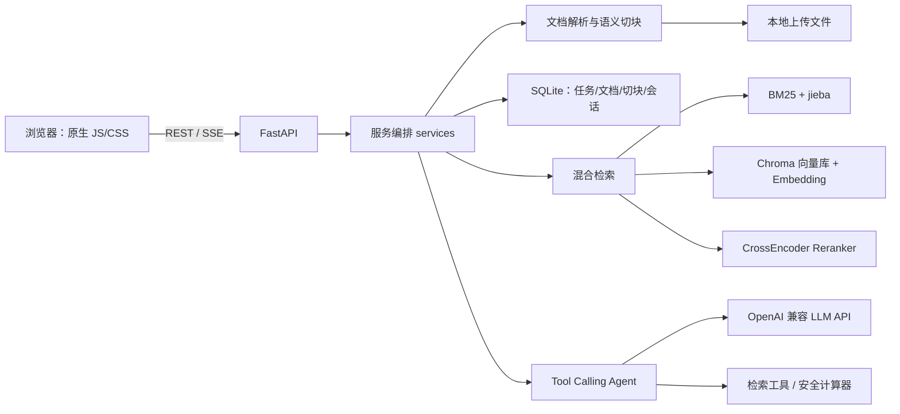

# KnowledgePilot Agent：项目技术栈与设计要点

> 定位：面向企业资料的知识库问答 Agent。用户在独立“知识任务”中上传文档，系统完成解析、混合检索、工具调用、带引用回答及可追溯展示。

## 1. 技术栈总览

| 层次 | 已使用技术 | 在项目中的作用 |
|---|---|---|
| 运行时 | Python 3.11、Conda | `knowledgepilot` 独立环境与依赖管理 |
| Web 后端 | FastAPI、Uvicorn、Pydantic v2 | REST/SSE API、请求校验、开发服务器 |
| 前端 | 原生 HTML、CSS、JavaScript | 任务管理、上传、Markdown、SSE 流式聊天 |
| 主数据存储 | SQLite、WAL、外键、事务 | 任务、文档元数据、切块、会话消息 |
| 原始文件 | 本地文件系统 | 上传文件的持久化保存 |
| 关键词检索 | BM25 风格倒排/持久化索引、jieba | 中文关键词召回与降级能力 |
| 语义检索 | sentence-transformers、ChromaDB | Embedding、向量持久化、语义召回 |
| 重排序 | sentence-transformers CrossEncoder | 对融合候选片段精排 |
| 文档解析 | pypdf、pdfplumber、python-docx、BeautifulSoup、python-pptx、csv | 支持 PDF/DOCX/HTML/CSV/PPTX 等资料 |
| OCR（可选） | pytesseract、pdf2image、Tesseract、Poppler | 扫描型 PDF 的文字识别 |
| LLM 接入 | OpenAI-compatible Chat Completions、httpx | Tool Calling、重试、超时、流式输出 |
| Agent | 有界工具调用循环 | 统一调用检索与计算器工具 |
| 测试与评测 | pytest、FastAPI TestClient、Recall@K、MRR | 单元/API 集成测试与离线检索评测 |
| 安全基础 | API Key、内存限流、输入校验、文件校验、AST 解释器 | MVP 的访问与输入风险控制 |

## 2. 整体架构

数据边界是 `task_id`：资料、切块、检索、消息历史都按任务隔离。该设计让“任务 1 的资料”不会成为“任务 2”的检索上下文。

## 3. 后端与 API

### FastAPI 与 Pydantic

- `app/main.py` 提供任务、文档、聊天、重建索引、会话历史 API。
- `ChatRequest`、`TaskCreate` 等 Pydantic 模型限制长度、拒绝额外字段，并清理控制字符。
- 上传使用 `multipart/form-data`，聊天使用 JSON。
- `BackgroundTasks` 将耗时的解析/切块/索引工作移出上传请求，文档状态为 `processing → ready/failed`。
- `StreamingResponse` 返回 `text/event-stream`；前端用 `fetch` 的 `ReadableStream` 消费 `token` 与 `done` 事件。

值得记忆：HTTP 的普通 JSON 响应适合“完成后一次性返回”；SSE 适合服务端向浏览器单向连续推送。SSE 结束事件中再携带 sources、faithfulness、trace，可避免丢失流式答案的元数据。

### LLM 客户端

`app/llm/client.py` 使用 `httpx` 调用 OpenAI 兼容的 `/chat/completions`：

- 通过环境变量配置模型、Base URL、超时与重试次数；
- 对网络错误、429、5xx 进行有限指数退避；
- 普通模式返回完整 `message`，流式模式解析上游 SSE 的 `delta`。

## 4. Agent 与工具调用

项目不是单纯“把 top-k 拼进 Prompt”，而是有界的 Tool Calling Agent：

1. 构建 system prompt、最近会话历史与工具定义。
2. 让模型选择 `search_knowledge_base` 或 `calculate`。
3. 服务端执行工具，检索结果以结构化 JSON 回填为 `tool` 消息。
4. 模型基于工具结果生成最终回答。
5. 限制最大工具轮数（`AGENT_MAX_TOOL_STEPS`），避免无限循环。

已注册工具：

- `search_knowledge_base(query)`：只能搜索当前任务切块，并返回 `document#chunk_id`，供模型内联引用。
- `calculate(expression)`：用于基础算术，服务端执行，模型不直接心算。

回答没有命中内部资料时仍会调用大模型，但会加上“基于通用知识、没有内部资料参考”的提示。这在企业知识库场景中兼顾了可用性与透明度。

## 5. RAG：解析、切块、检索、重排与引用

### 文档处理

支持 TXT、Markdown、PDF、DOCX、HTML、CSV、PPTX：

- Markdown/文本：按标题和段落进行结构感知切块，不再固定 450 字硬切。
- PDF：先用 `pypdf`；文本不足时改用 `pdfplumber` 提取页面和表格；启用 `ENABLE_OCR=1` 时可走 Tesseract OCR。
- DOCX：读取段落与表格；HTML：提取标题、段落、列表、表格行；CSV：按行保留字段；PPTX：提取幻灯片文本。

### 混合检索

`HybridRetriever` 组合三类信号：

1. **BM25**：对精确术语、产品型号、制度编号很强；jieba 改善中文分词。
2. **向量检索**：Embedding 将问题与切块映射到向量空间，能召回“年假怎么休”与“带薪休假政策”一类近义表达。
3. **RRF 融合 + CrossEncoder 重排**：先融合两路候选，再由 reranker 对“问题—片段对”精排。

向量库或 reranker 不可用时，系统会降级为 BM25/RRF，并在 trace 中标记降级原因。这个“优雅降级”是生产系统重要的可靠性原则。

### Grounding 与 Faithfulness

- Prompt 要求引用准确的 `[document#chunk_id]`。
- 后端检查答案引用是否属于本次检索 sources，检查长陈述是否缺引用。
- 前端显示引用校验状态、检索轨迹及可展开的来源原文。

注意：当前 Faithfulness 是确定性规则检查，不等价于 NLI/LLM 事实蕴含判定；它能捕获伪造/遗漏引用，但不能完全证明语义正确。

## 6. 数据存储与任务管理

SQLite 负责主数据而非 JSON：

- 表：`tasks`、`documents`、`chunks`、`messages`；
- 开启 WAL，提高读写并发能力；启用外键和事务；
- 旧 JSON 可首次迁移，保留原文件作为备份；
- 删除任务时级联删除文档、切块和归属消息，再清理上传文件；
- 文档可以删除或重新索引。

需要理解：数据库事务能保证数据库内部原子性；文件系统删除不能与 SQLite 共用同一个事务，因此代码采用先后顺序与补偿清理思路降低不一致风险。

## 7. 前端体验

原生前端无 React/Vue 依赖，适合 MVP：

- 任务列表、资料列表、上传状态、删除任务/文件、重新索引；
- 以 `localStorage` 保存当前任务及“任务 → session_id”的映射；切回任务时调用任务限定的历史 API；
- 对模型回答进行安全的轻量 Markdown 渲染；
- SSE 流式追加答案；
- 显示 route、trace、引用校验和来源片段正文。

## 8. 安全与工程化

已实现的 MVP 防护：

- `KNOWLEDGEPILOT_API_KEYS` 配置后启用 `X-API-Key` 校验；未设置时便于本地开发。
- 单进程内存限流：聊天、上传、一般 API 分桶限流。
- 文件大小、后缀、PDF 文件头、UTF-8、Office ZIP 结构/条目数/解压大小检查。
- 计算器不使用 `eval()`，而是递归解释受限 AST；限制长度、节点数、指数与结果范围。

生产环境仍需补充：JWT/SSO、用户/组织/角色权限、Redis 限流、对象存储、病毒扫描、审计日志、密钥管理和监控告警。

## 9. 测试与评测

当前 pytest 覆盖服务层和 API 集成流程，包括：任务隔离、文档处理、异步入库状态、删除级联、无命中 LLM 路由、引用校验、工具循环、SSE、API Key、限流、输入消毒、计算器安全。

`evals/run_retrieval_eval.py` 用真实问题集统计：

- **Recall@K**：前 K 条是否出现正确资料；
- **MRR**：正确资料第一次出现得有多靠前。

应把业务高频问题、正确文档和标准答案维护为版本化评测集；每次改 chunk、embedding、检索权重或 reranker 都运行一次，避免质量回退。

## 10. 面试可用的项目表述

“独立设计并实现企业知识库问答 Agent：基于 FastAPI、SQLite 与 ChromaDB 构建任务隔离的文档问答系统，支持多格式解析、语义切块、BM25+向量混合检索与 CrossEncoder 重排；通过 OpenAI-compatible Tool Calling 编排检索与计算工具，支持 SSE 流式回答、内联引用和引用一致性校验；同时实现文档重建索引、会话恢复、API Key、限流、上传校验及 Recall@K/MRR 离线评测。”
